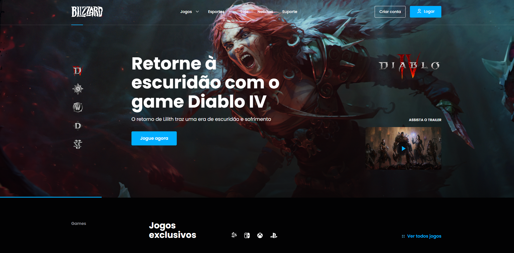
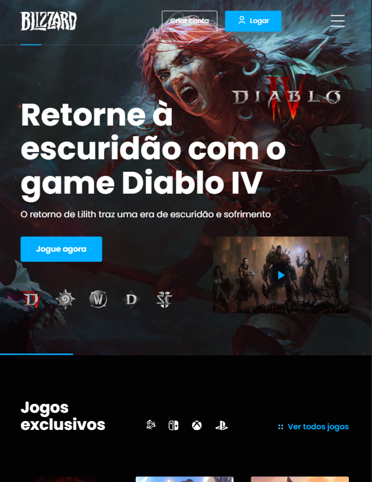

<h1 align="center">
  Br-Challenges Blizzard
</h1>

  
  
  
  
  

  
  
  

  

## 💻 Projeto
Projeto feito para o desafio da BrChallenges de criar uma landing page da blizzard na dificulade dificl.

[Site aqui](https://blizzard-br-challenges-omega.vercel.app/)

## 🚀 Tecnologias
  

- HTML
- CSS
- Javascript

## 📔 Principais Requisitos

- [x] Criar as seções: Menu, Banner hero, Footer.
- [x] responsividade: 1920px, 1440px, 768px e 375px.
- [x] modal-login.
- [x] Jogos via api.
- [x] drop-down.
- [x] gif na preview video.
- Entre outros.

  

